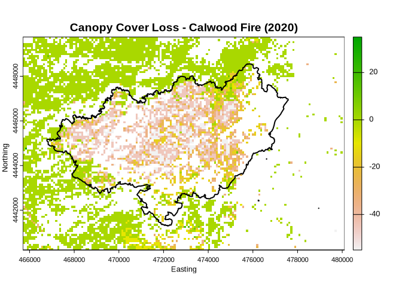
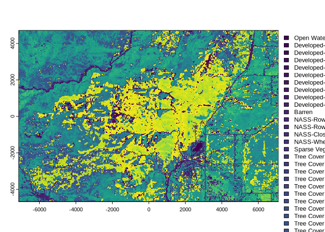

<!-- README.md is generated from README.Rmd. Please edit that file -->


<br><br>

## rlandfire: Interface to ‘LANDFIRE Product Service’ API

<!-- badges: start -->


[](https://github.com/bcknr/rlandfire/actions/workflows/R-CMD-check.yaml)
<!-- badges: end -->

`rlandfire` provides access to a diverse suite of spatial data layers
via the LANDFIRE Product Services
([LFPS](https://lfps.usgs.gov/arcgis/rest/services/LandfireProductService/GPServer))
API. [LANDFIRE](https://landfire.gov) is a joint program of the USFS,
DOI, and other major partners, which provides data layers for wildfire
management, fuel modeling, ecology, natural resource management,
climate, conservation, etc. The complete list of available layers and
additional resources can be found on the LANDFIRE webpage.

## Installation

Install `rlandfire` from CRAN:

``` r
install.packages("rlandfire")
```

The development version of `rlandfire` can be installed from GitHub
with:

``` r
# install.packages("devtools")
devtools::install_github("bcknr/rlandfire")
```

Set `build_vignettes = TRUE` to access this vignette in R:

``` r
devtools::install_github("bcknr/rlandfire", build_vignettes = TRUE)
```

This package is still in development, and users may encounter bugs or
unexpected behavior. Please report any issues, feature requests, or
suggestions in the package’s [GitHub
repo](https://github.com/bcknr/rlandfire/issues).

## Using `rlandfire`

To demonstrate `rlandfire`, we will explore how ponderosa pine forest
canopy cover changed after the 2020 Calwood fire near Boulder, Colorado.

``` r
library(rlandfire)
library(sf)
library(terra)
library(foreign)
```

First, we will load the Calwood Fire perimeter data which was downloaded
from Boulder County’s [geospatial data
hub](https://opendata-bouldercounty.hub.arcgis.com/).

``` r
boundary_file <- file.path(tempdir(), "wildfire")
utils::unzip(system.file("extdata/wildfire.zip", package = "rlandfire"),
             exdir = tempdir())

boundary <- st_read(file.path(boundary_file, "wildfire.shp")) %>% 
  sf::st_transform(crs = st_crs(32613))
#> Reading layer `wildfire' from data source `/tmp/RtmpV4trFT/wildfire/wildfire.shp' using driver `ESRI Shapefile'
#> Simple feature collection with 1 feature and 7 fields
#> Geometry type: MULTIPOLYGON
#> Dimension:     XY
#> Bounding box:  xmin: -105.3901 ymin: 40.12149 xmax: -105.2471 ymax: 40.18701
#> Geodetic CRS:  WGS 84

plot(boundary$geometry, main = "Calwood Fire Boundary (2020)", 
     border = "red", lwd = 1.5)
```


### AOI

We can use the function `rlandfire::getAOI()` to create an area of
interest (AOI) vector with the correct format for `landfireAPIv2()`.
`getAOI()` handles several steps for us, it ensures that the AOI is
returned in the correct order (`xmin`, `ymin`, `xmax`, `ymax`) and
converts the AOI to latitude and longitude coordinates (as required by
the API) if needed.

Using the `extend` argument, we will increase the AOI by 1 km in all
directions to provide additional context surrounding the burned area.
This argument takes an optional numeric vector of 1, 2, or 4 elements.

``` r
aoi <- getAOI(boundary, extend = 1000)
aoi
#> [1] -105.40207   40.11224 -105.23526   40.19613
```

Alternatively, you can supply a LANDFIRE map zone number in place of the
AOI vector. The function `getZone()` returns the zone number containing
an `sf` object or which corresponds to the supplied zone name. See
`help("getZone")` for more information and an example.

### Products

For this example, we are interested in canopy cover data for two years,
2019 (`200CC_19`) and 2022 (`220CC_22`), and existing vegetation type
(`200EVT`). All available data products, and their abbreviated names,
can be found in the [products table](https://lfps.usgs.gov/products)
which can be opened by calling `viewProducts()`.

``` r
products <- c("200CC_19", "220CC_22", "200EVT")
```

### Email

``` r
email <- "rlandfire@example.com"
```

### Projection and resolution

We can ask the API to project the data to the same CRS as our fire
perimeter data by providing the `WKID` for our CRS of interest and a
resolution of our choosing, in meters.

``` r
projection <- 32613
resolution <- 90
```

### Edit rule

We will use the `edit_rule` argument to filter out canopy cover data
that does not correspond to Ponderosa Pine Woodland. The `edit_rule`
statement should tell the API that when existing vegetation cover is
anything other than Ponderosa Pine Woodland (`7054`), the value of the
canopy cover layers should be set to a specified value.

To do so, we specify that when `220EVT` is not equal (`ne`) to `7054`,
the “condition,” the canopy cover layers should be set equal (`st`) to
`1`, the “change.” The edit rule syntax is explained in more depth in
the [LFPS guide](https://lfps.usgs.gov/LFProductsServiceUserGuide.pdf).

*(How the API applies edit rules can be unintuitive. For example, if we
used ‘clear value’ \[`cv`\] or set the value outside of 0-100 the edits
we want would not work. To work around this behavior, we set the values
to `1` since it is not found in the original data set.*)

``` r
edit_rule <- list(c("condition","200EVT","ne",7054),
                  c("change", "200CC_19", "st", 1),
                  c("change", "220CC_22", "st", 1))
```

Note: Edits are performed in the order that they are listed and are
limited to fuel theme products (i.e., Fire Behavior Fuel Model 13, Fire
Behavior Fuel Model 40, Forest Canopy Base Height, Forest Canopy Bulk
Density, Forest Canopy Cover, and Forest Canopy Height).

If we wanted to restrict these edits to a certain area we could pass the
path to a zip archive (`.zip`) containing a shapefile to `edit_mask`:

``` r
edit_mask <- "path/to/wildfire.zip"
```

Note: The file must follow ESRI shapefile naming standards (e.g., no
special characters) and be less than 1MB in size.

### Path

Finally, we will provide a path to a temporary zip file. Setting the
path as a temp file is not strictly necessary because if `path` is left
blank `landfireAPIv2()` will save the data to a temporary folder by
default.

``` r
path <- tempfile(fileext = ".zip")
```

### Call `landfireAPIv2()`

Now we are able to submit a request to the LANDFIRE Product Services API
with the `landfireAPIv2()` function.

``` r
resp <- landfireAPIv2(products = products,
                    aoi = aoi, 
                    email = email,
                    projection = projection, 
                    resolution = resolution,
                    edit_rule = edit_rule,
                    path = path,
                    verbose = FALSE)
```

`landfireAPIv2()` will download your requested data into the folder
provided in the path argument. If you did not provide one, you can find
the path to your data in the `$path` element of the `landfire_api`
object.

``` r
resp$path
```

### Load and process LF data

The files returned by the LFPS API are compressed `.zip` files. We need
to unzip the directory before reading the `.tif` file. Note: all
additional metadata is included in this same directory.

``` r
lf_dir <- file.path(tempdir(), "lf")
utils::unzip(path, exdir = lf_dir)

lf <- terra::rast(list.files(lf_dir, pattern = ".tif$", 
                             full.names = TRUE, 
                             recursive = TRUE))
```

Now we can reclassify the canopy cover layers to remove any values which
are not classified as Ponderosa Pine, calculate the change, and plot our
results.

``` r
lf$US_200CC_19[lf$US_200CC_19 == 1] <- NA
lf$US_220CC_22[lf$US_220CC_22 == 1] <- NA

change <- lf$US_220CC_22 - lf$US_200CC_19

plot(change, col = rev(terrain.colors(250)),
     main = "Canopy Cover Loss - Calwood Fire (2020)",
     xlab = "Easting",
     ylab = "Northing")
plot(boundary$geometry, add = TRUE, col = NA,
     border = "black", lwd = 2)
```



### Working with Categorical Products

The LFPS REST API now embeds attributes in the GeoTIFF files for some
variables and returns a database file (`.dbf`) containing the full
attribute table.

To demonstrate, we will download the Existing Vegetation Cover product
from LF 2.4.0 (`240EVC`). Unlike in the example above we will submit a
minimal request with the default projection and resolution. We will also
allow `rlandfire` to save the files to a temporary directory
automatically. As mentioned above, we can find the path to the temporary
directory in the `$path` element of the `landfire_api` object returned
by `landfireAPIv2()`.

``` r
resp <- landfireAPIv2(products = "240EVC",
                    aoi = aoi,
                    email = email,
                    verbose = FALSE)
```

When we read in and plot the EVC layer the legend will now list the
`classnames` for each vegetation type.

``` r
lf_cat <- file.path(tempdir(), "lf_cat")
utils::unzip(resp$path, exdir = lf_cat)

evc <- terra::rast(list.files(lf_cat, pattern = ".tif$", 
                             full.names = TRUE, 
                             recursive = TRUE))

plot(evc)
```



To access the values each `classname` is assigned to we can uses the
`levels()` function. This returns a simple two column data frame
containing both the index and active category, in our case the
vegetation cover classes.

``` r
head(levels(evc)[[1]])
#>   Value                        CLASSNAMES
#> 1    11                        Open Water
#> 2    13 Developed-Upland Deciduous Forest
#> 3    14 Developed-Upland Evergreen Forest
#> 4    15     Developed-Upland Mixed Forest
#> 5    16       Developed-Upland Herbaceous
#> 6    17        Developed-Upland Shrubland
```

Alternatively, we can access the full attribute table using two methods.
We can use the function `cats()` which works similarly to `levels()` but
returns the full attribute table as a data frame. Alternatively, we can
read the database file using `foreign::read.dbf()`. Both methods return
similar results, although in this case, we see that the `.dbf` file
includes an additional `Count` column not included in the data frame
returned from `cats()`.

``` r
# cats
attr_tbl <- cats(evc)

# Find path to database file
dbf <- list.files(lf_cat, pattern = ".dbf$",
                  full.names = TRUE,
                  recursive = TRUE)

# Read file
dbf_tbl  <- foreign::read.dbf(dbf)

head(attr_tbl[[1]])
#>   Value                        CLASSNAMES Count   R   G   B RED GREEN BLUE
#> 1    11                        Open Water   229   0   0 255   0     0  255
#> 2    13 Developed-Upland Deciduous Forest   119  64  61 168  64    61  168
#> 3    14 Developed-Upland Evergreen Forest   337  68  79 137  68    79  137
#> 4    15     Developed-Upland Mixed Forest   198 102 119 205 102   119  205
#> 5    16       Developed-Upland Herbaceous   365 122 142 245 122   142  245
#> 6    17        Developed-Upland Shrubland   181 158 170 215 158   170  215
head(dbf_tbl)
#>   Value Count                        CLASSNAMES   R   G   B      RED    GREEN
#> 1    11   229                        Open Water   0   0 255 0.000000 0.000000
#> 2    13   119 Developed-Upland Deciduous Forest  64  61 168 0.250980 0.239216
#> 3    14   337 Developed-Upland Evergreen Forest  68  79 137 0.266667 0.309804
#> 4    15   198     Developed-Upland Mixed Forest 102 119 205 0.400000 0.466667
#> 5    16   365       Developed-Upland Herbaceous 122 142 245 0.478431 0.556863
#> 6    17   181        Developed-Upland Shrubland 158 170 215 0.619608 0.666667
#>       BLUE
#> 1 1.000000
#> 2 0.658824
#> 3 0.537255
#> 4 0.803922
#> 5 0.960784
#> 6 0.843137
```

### Citation

Visit the [LANDFIRE webpage](https://landfire.gov/data/citation) for
information on citing LANDFIRE data layers. The package citation
information can be viewed with `citation("rlandfire")`.
