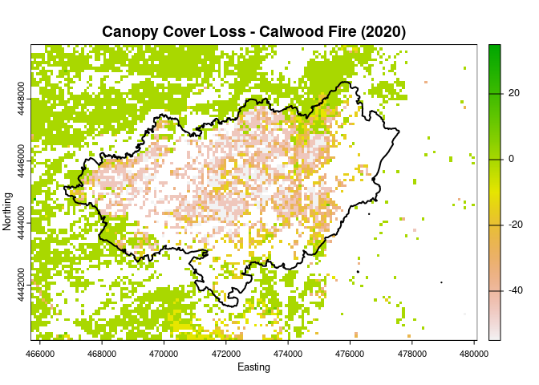

<!-- README.md is generated from README.Rmd. Please edit that file -->


## rlandfire: Tools for Accessing and Working with LANDFIRE in R


<!-- badges: start -->
<!-- badges: end -->

  
`rlandfire` provides access to a diverse suite of spatial data layers
via the LANDFIRE Product Services
([LFPS](https://lfps.usgs.gov/arcgis/rest/services/LandfireProductService/GPServer))
API. [LANDFIRE](https://landfire.gov) is a joint program of the USFS,
DOI, and other major partners, which provides data layers for wildfire
management, fuel modeling, ecology, natural resource management,
climate, conservation, etc. The complete list of available layers and
additional resources can be found on the LANDFIRE webpage.

## Installation

`rlandfire` can be installed from GitHub with:

``` r
# install.packages("devtools")
devtools::install_github("bcknr/rlandfire")
```

Set `build_vignettes = TRUE` to access this vignette in R:

``` r
devtools::install_github("bcknr/rlandfire", build_vignettes = TRUE)
```

This package is still in development, and users may encounter bugs or
unexpected behavior. Please report any issues, feature requests, or
suggestions in the package’s [GitHub
repo](https://github.com/bcknr/rlandfire/issues).

## `rlandfire` vs LANDFIRE Product Service (LFPS)


## Using `rlandfire`

To demonstrate `rlandfire`, we will explore how Ponderosa Pine forest
canopy cover changed after the 2020 Calwood fire near Boulder, Colorado.

``` r
library(rlandfire)
library(sf)
#> Linking to GEOS 3.8.0, GDAL 3.0.4, PROJ 6.3.1; sf_use_s2() is TRUE
library(terra)
#> terra 1.7.29
```

To start, we will load in the boundary of the Calwood Fire, which I
previously downloaded from Boulder County’s [geospatial data
hub](https://opendata-bouldercounty.hub.arcgis.com/).

``` r
boundary_file <- file.path(tempdir(), "Wildfire_History")
utils::unzip("./inst/extdata/Wildfire_History.zip", exdir = boundary_file)

boundary <- st_read(file.path(boundary_file, "Wildfire_History.shp")) %>% 
  sf::st_transform(crs = st_crs(32613))
#> Reading layer `Wildfire_History' from data source 
#>   `/tmp/Rtmp8dnmtX/Wildfire_History/Wildfire_History.shp' using driver `ESRI Shapefile'
#> Simple feature collection with 1 feature and 7 fields
#> Geometry type: MULTIPOLYGON
#> Dimension:     XY
#> Bounding box:  xmin: -105.3901 ymin: 40.12149 xmax: -105.2471 ymax: 40.18701
#> Geodetic CRS:  WGS 84

plot(boundary$geometry, main = "Calwood Fire Boundary (2020)", 
     border = "red", lwd = 1.5)
```


### AOI

We can use the function `rlandfire::getAOI()` to create an area of
interest (AOI) vector with the correct format for `landfireAPI()`.
`getAOI()` handles several steps for us, it ensures that the AOI is
returned in the correct order (`xmin`, `ymin`, `xmax`, `ymax`) and
converts the AOI to latitude and longitude coordinates (required by the
API) if needed.

Using the `extend` argument, we will increase the AOI by 1 km in all
directions to provide additional context surrounding the burned area.
This argument takes an optional numeric vector of 1, 2, or 4 elements
passed to `terra::extend()`.

``` r
aoi <- getAOI(boundary, extend = 1000)
aoi
#> [1] -105.40207   40.11224 -105.23526   40.19613
```

### Products

We are interested in two canopy cover products, canopy cover in 2019
(`200CC_19`) and 2022 (`220CC_22`), and the existing vegetation type
(`200EVT`). All available data products, and their abbreviated names,
can be found in the [products
table](https://lfps.usgs.gov/helpdocs/productstable.html).

``` r
products <- c("200CC_19", "220CC_22", "200EVT")
```

### Projection and resolution

We can ask the API to project the data to the same CRS as our boundary
data by providing the `WKID` for our CRS of interest and a resolution of
our choosing, in meters.

``` r
projection <- 32613
resolution <- 90
```

### Edit rule

We will use the `edit_rule` argument to filter out canopy cover data
that doesn’t correspond to Ponderosa Pine Woodland. To do this, we will
use an `edit_rule` statement which says that when existing vegetation
cover is anything other than Ponderosa Pine Woodland, the value of the
canopy cover should be set to a specified value.

Specifically, we specify that when `220EVT`, the condition, is not equal
(`ne`) to `7054` the canopy cover layers should be set equal (`st`) to
`1`. (*There is some weird behavior with the API where clear value
\[`cv`\] or setting the value outside of 0-100 doesn’t work. So here we
are using `1` since it is not found in the original data*).

``` r
edit_rule <- list(c("condition","200EVT","ne",7054),
                  c("change", "200CC_19", "st", 1),
                  c("change", "220CC_22", "st", 1))
```

Our requested edits are a relatively simple implementation of
`edit_rule`, and it is important to note that edits are limited to fuel
theme products (i.e., Fire Behavior Fuel Model 13, Fire Behavior Fuel
Model 40, Forest Canopy Base Height, Forest Canopy Bulk Density, Forest
Canopy Cover, and Forest Canopy Height). The syntax is explained in the
[LFPS
guide](https://lfps.usgs.gov/helpdocs/LFProductsServiceUserGuide.pdf),
and the rules are evaluated in the order they are listed.

### Path

Finally, we will provide a path to a temporary zip file. Setting the
path as a temp file is not strictly necessary because if `path` is left
blank `landfireAPI()` will save the data to a temporary folder by
default.

``` r
path <- tempfile(fileext = ".zip")
```

### Call `landfireAPI()`

Now we are able to submit a request to the LANDFIRE Product Services API
with the `landfireAPI()` function.

``` r
resp <- landfireAPI(products = products,
                    aoi = aoi, 
                    projection = projection, 
                    resolution = resolution,
                    edit_rule = edit_rule,
                    path = path,
                    verbose = FALSE)
```

`landfireAPI()` will download your requested data into the folder
provided in the path argument. If you didn’t provide one, you can find
the path to your data in the `$path` element of the `landfire_api`
object returned by `landfireAPI()`.

``` r
resp$path
#> [1] "/tmp/Rtmp8dnmtX/file2b7c524f6b13.zip"
```

### Load and process LF data

The files returned by the LFPS API are compressed `.zip` files. We need
to unzip them before reading the file ending in `.tif`. Note: all
additional metadata is included in this same directory as well.

``` r
lf_dir <- file.path(tempdir(), "lf")
utils::unzip(path, exdir = lf_dir)

lf <- terra::rast(list.files(lf_dir, pattern = ".tif$", full.names = TRUE))
```

Now we can reclassify the canopy cover layers to remove any values which
are not classified as Ponderosa Pine, calculate the change, and plot.

``` r
lf$US_200CC_19[lf$US_200CC_19 == 1] <- NA
lf$US_220CC_22[lf$US_220CC_22 == 1] <- NA

change <- lf$US_220CC_22 - lf$US_200CC_19

plot(change, col = rev(terrain.colors(250)),
     main = "Canopy Cover Loss - Calwood Fire (2020)",
     xlab = "Easting",
     ylab = "Northing")
plot(boundary$geometry, add = TRUE, col = NA,
     border = "black", lwd = 2)
```



## License

[](https://www.gnu.org/licenses/gpl-3.0.html)

This program is free software: you can redistribute it and/or modify it
under the terms of the GNU General Public License as published by the
Free Software Foundation, either version 3 of the License, or (at your
option) any later version.

This program is distributed in the hope that it will be useful, but
WITHOUT ANY WARRANTY; without even the implied warranty of
MERCHANTABILITY or FITNESS FOR A PARTICULAR PURPOSE. See the GNU General
Public License for more details.

You should have received a copy of the GNU General Public License along
with this program. If not, see <https://www.gnu.org/licenses/>.

### Citation

Visit the [LANDFIRE webpage](https://landfire.gov/landfire_citation.php)
for information on citing LANDFIRE data layers. The package citation
information can be viewed with `citation("rlandfire")`.
